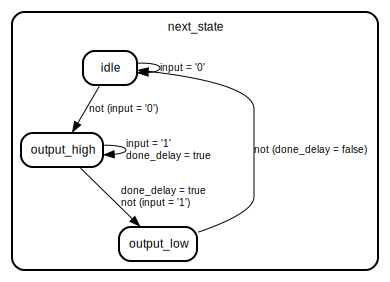

# Entity: debouncer 
- **File**: debouncer.vhd

## Diagram

## Generics

| Generic name  | Type | Value | Description |
| ------------- | ---- | ----- | ----------- |
| clk_period    | time | 20 ns |             |
| debounce_time | time |       |             |

## Ports

| Port name | Direction | Type       | Description |
| --------- | --------- | ---------- | ----------- |
| clk       | in        | std_ulogic |             |
| rst       | in        | std_ulogic |             |
| input     | in        | std_ulogic |             |
| debounced | out       | std_ulogic |             |

## Signals

| Name          | Type       | Description |
| ------------- | ---------- | ----------- |
| current_state | State_Type |             |
| next_state    | State_Type |             |
| done_delay    | boolean    |             |
| start_clock   | std_ulogic |             |

## Types

| Name       | Type                                                                                                    | Description |
| ---------- | ------------------------------------------------------------------------------------------------------- | ----------- |
| State_Type | (idle,  output_high,  output_low) |             |

## Processes
- STATE_MEMORY: ( clk, rst )
- NEXT_STATE_LOGIC: ( input, done_delay, rst )
- OUTPUT_LOGIC: ( current_state, done_delay )

## Instantiations

- delay_counter: timed_counter

## State machines

