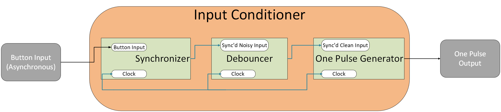
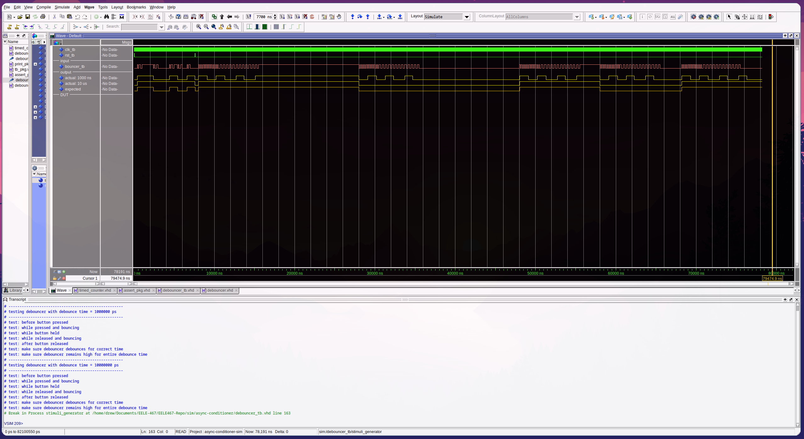
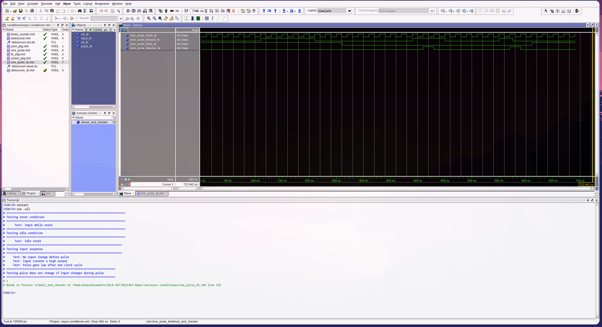
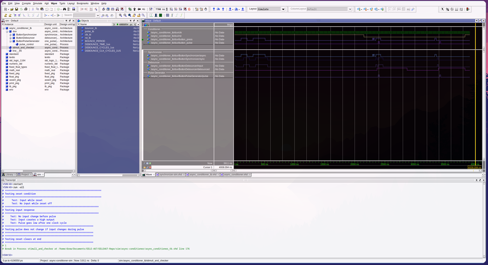

# HW-6 Async Conditioner

## Overview
This component takes in a non-debounced button input with active high and returns a single pulse as an output. This follows the block diagram shown below. 

This required the creation and testing of both a debouncer for the button press and a one-pulse output generator. Connecting all of these pieces together created the input conditioner which will be re-used in Lab 04. 

## Deliverables

Included are the waveforms associated with the Debouncer, One-Pulse, and Input Conditioner in their respective order.

