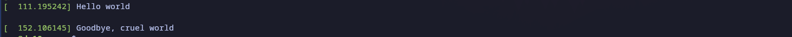
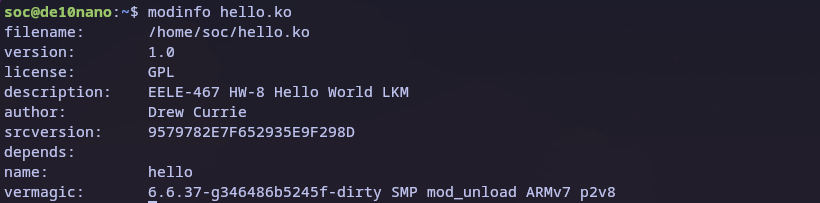

# HW-8 "Hello world" Linux Kernel Module

## Overview
In this homework a Linux Kernel Module to print ```c "Hello World ``` and ```c Goodbye, cruel world``` on load and un-load respectively was created. This involved cross compiling for ARM and inserting the kernel module into the running Linux kernel on the DE10Nano SoC FPGA.

## Deliverables
Kernel info print messages on load and un-load
<p align="center">

</p>

Uname of the FPGA and my computer
<p align="center">

</p>

<p align="center">

</p>


Mod info for the hello world kernel module
<p align="center">

</p>
