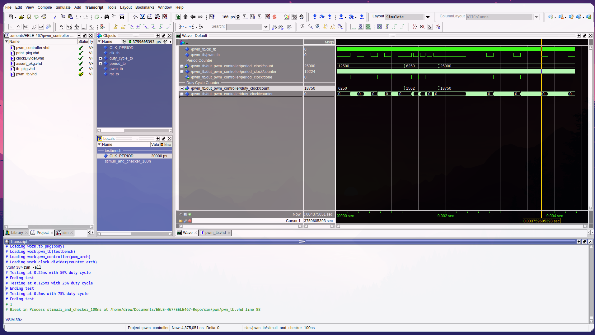
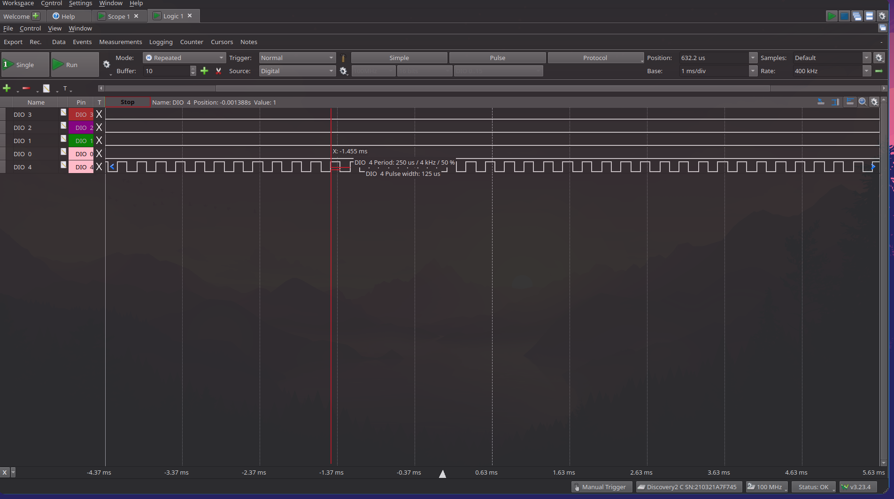

# HW-9 PWM Controller VHDL

## Overview
In this homework a PWM controller was created in hardware that takes in a period and duty cycle. The period is given in milliseconds, with a format of 6 whole bits and 24 fractional bits. The duty cycle is a percentage ranging from 0-1 with 1 whole bit and 10 fractional bits. This system uses a fixed point precision to achieve the PWM generation. 

## Deliverables
ModelSim VHDL testbench results:

FPGA PWM generation with logic analyzer. In this test the period was hard coded to .25ms with a duty cycle of 50%. Additional testing points were probed on the FPGA for debugging. Channel 4 on the screen shot corresponds with the PWM generator. 

