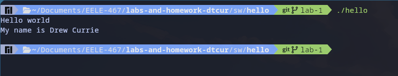

# This is the largest heading in MD
## This is the next largest heading in MD
### Instead of writing the same thing I decided to write this. 

**This is some bold text in theory** 

_This has been Italicized_

> This is a block qoute in GH markdown format. WOW! 
>
>Going to a second line is also possible with this syntax when you add line breaks

> [!CAUTION]
> This doesn't render quite right on the markdown preview extension for VS Code. 

> [!WARNING]
> Urgent info that needs immediate user attention to avoid problems.

^^ Direct copy/paste from github guide also didn't render so maybe this rendering engine on VS Code is out of date or something


``` C
printf("Hellow World" \n\r "This is syntax highlighted markdown code snippets!");
```

| This is a   | *Drumroll* TABLE! |
| ------------- | ------------- |
| Content Cell  | Content Cell  |
| Content Cell  | Content Cell  |


- This is a list 
* That is un-ordered
+ Aint this cool?

3. This is an ordered list
2. That auto increases from 
1. The first number despite the MD
0. Being 3 -> 2 -> 1 -> 0 

[Random Website](https://www.youtube.com/watch?v=dQw4w9WgXcQ)


