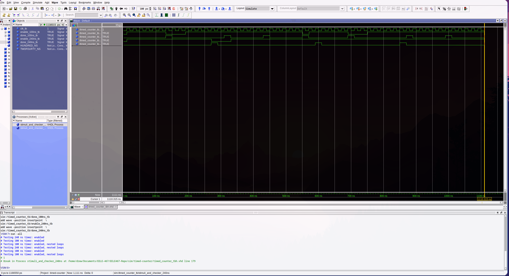

# HW-4 Timed Counter

## Overview
A timed counter was created along with the test bench to create a counter that will count for a specified duration of time and assert a done signal when that time has elapsed. 

## Deliverables

