# Homework 7: Linux CLI Practice

## Overview
Using some common string manipulation Linux CLI commands. 

## Deliverables

###
> 'wc -w lorem-ipsum.txt'
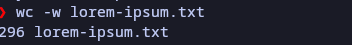

###
> 'wc -m lorem-ipsum.txt'
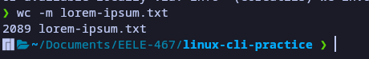
###
> 'wc -l lorem-ipsum.txt'
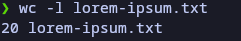
###
> 'sort -h file-sizes.txt'
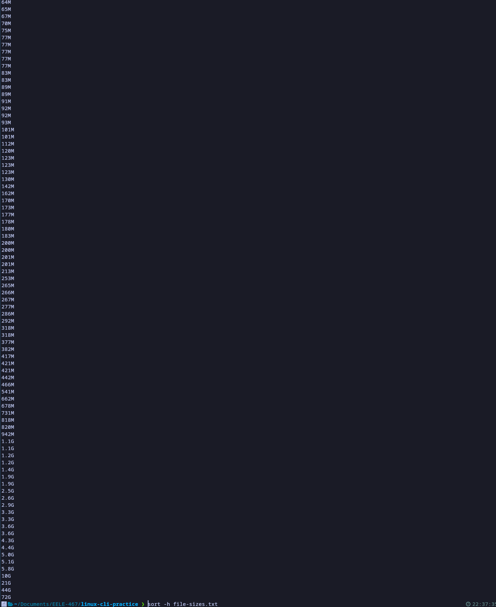
###
>'sort -h -r file-sizes.txt'

###
>'cut -d, -f3 log.csv
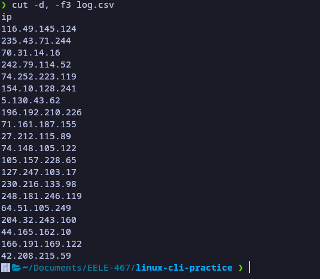
###
>'cut -d, -f2,3 log.csv'
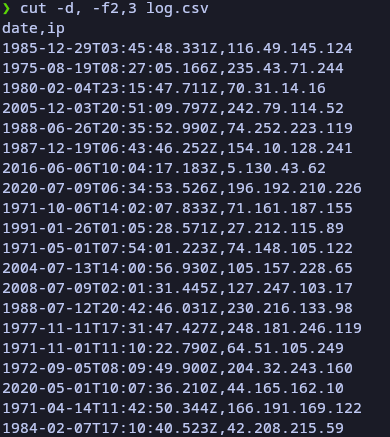
###
>'cut -d -f1,4 log.csv'
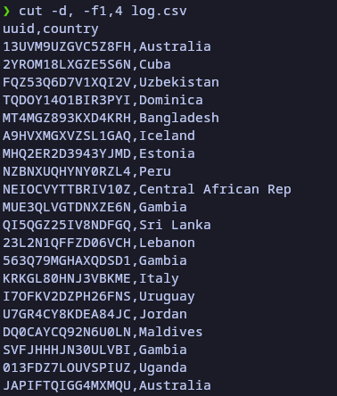
###
>'head -n 3 gibberish.txt
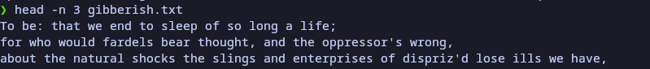
###
>'tail -n 2 gibberish.txt'
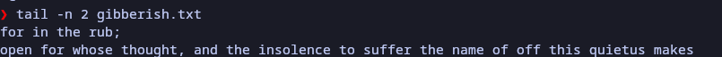
###
>'tail -n 20 log.csv'
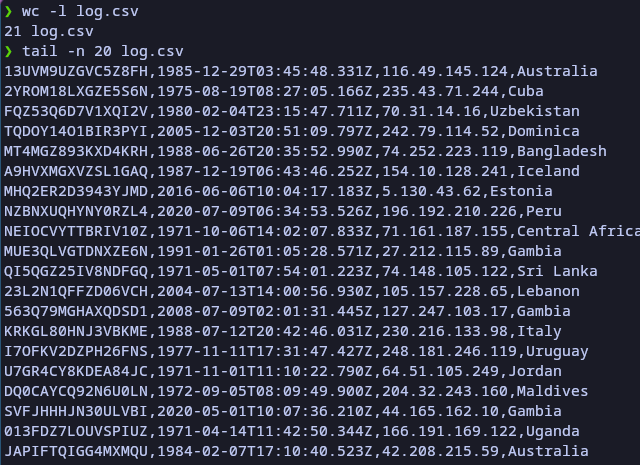
###
>'cat gibberish.txt | grep and'
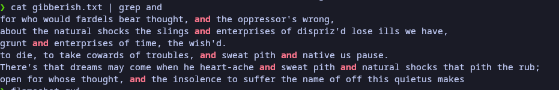
###
>'cat gibberish.txt | grep -w we'
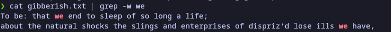
###
>'Did not complete'
###
>'wc -l fpgas.txt | cut -d' ' -f1'

###
>'Did not complete'
###
>'grep -cr --include "*.vhd" '--' ../EELE467-Repo/hdl/*'
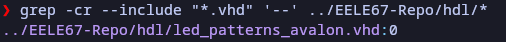
So on this one, none of my comments start a new line. They're all indented which grep doesn't like. Also I only have one vhd file in my hdl folder as the rest are in sim. 
###

>'ls > ls-output.txt && cat ls-output.txt'
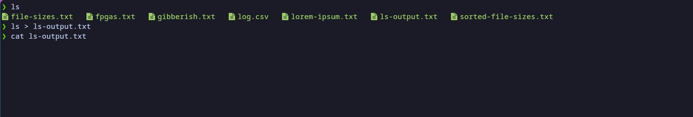
However, this does not work with my terminal since I repalced ls with lsx. So I did a different thing instead. 
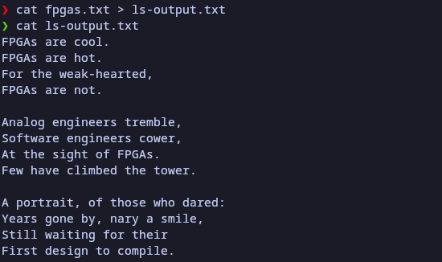
###
>'sudo dmesg | grep cpu'
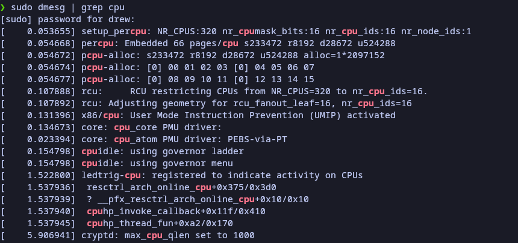
###
>'find ../EELE467-Repo/hdl/ -iname '*.vhd' | wc -l'

###
>'grep -cr --include "*.vhd" '.*--.*' ../EELE467-Repo/hdl/*'
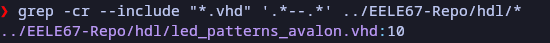
###
>'cat fpgas.txt | grep -n FPGAs | cut -d':' -f1'
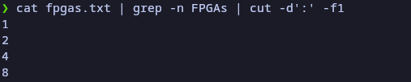
###
>'du -h * | sort -hr | head -n 3'
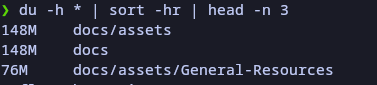

