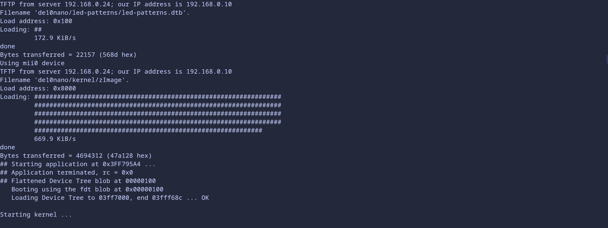
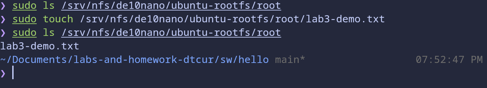
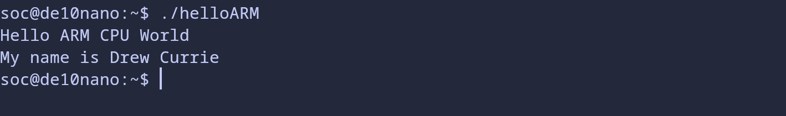

# Lab 3 Developer's Setup 

## Overview
Creating a FTP and NFS server to allow the SoC FPGA to boot over a LAN from our computer's hardrive. This allows for the FPGA to be easily controlled from teh host computer. 

## Deliverables

#### Demo #1:
The FPGA was booted over the network from our servers. The IP address is slightly different from the book to accomodate my home network so I didn't need to be connected via ethernet. 

##### Demo #2: 
Creating a new file was acheived in the NFS server which connects to the FPGA allowing for files to be easily transfered. 

#### Demo #3:
Running the cross compiled hello world file.
