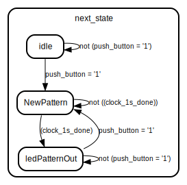

# EELE-467 Lab 04 LED Pattern State Machine

## Overview
The goal of this lab was to create a hardware implementation of a state machine that takes in user input from a push button and switches. These inputs allow the user to select the pattern and change the state. 

## Deliverables

### Block Diagram

The system will be responsible for taking in user input from the switches and push button. The push button will change to the next pattern based on the value selected on the switches. The switches can represent a maximum of 15 decimal however, only 4 patterns are available. If an input of greater than 4 is entered, the system will reject the new input and keep the previous pattern. 

### Input Conditioner 

The input conditioner will handle creating a synchronized and debounced button input. This input is then passed through a one-pulse generator. This will create a single pulse for one clock cycle. This cleaned input will allow for consistent button presses and reject bouncing of the button. 

#### Diagram

#### Ports

| Port name    | Direction | Type       | Description |
| ------------ | --------- | ---------- | ----------- |
| clk          | in        | std_ulogic |             |
| rst          | in        | std_ulogic |             |
| button_press | in        | std_ulogic |             |
| button_pulse | out       | std_ulogic |             |

#### Signals

| Name              | Type       | Description |
| ----------------- | ---------- | ----------- |
| syncd_noisy_input | std_ulogic |             |
| syncd_clean_input | std_ulogic |             |

#### Constants

| Name          | Type | Value  | Description |
| ------------- | ---- | ------ | ----------- |
| debounce_time | time | 500 ns |             |
| clk_period    | time | 20 ns  |             |

### Instantiations

- ButtonSynchronizer: synchronizer
- ButtonDebouncer: debouncer
- ButtonPulseGenerator: one_pulse

### Main State Machine
The main state machine will handle changing states to determine the LED output. The LEDs will output the pattern selected on the switches. The idle state will begin displaying LED pattern 0 which is a walking right single bit. When in this state, an input on the button press will change the state to the ledPatternOut which will display the current pattern. The patterns available are shown in the block diagram. 

### System Summary 

#### Source TerosHDL System Summary
# Entity: led_patterns 

### Generics

| Generic name        | Type | Value | Description |
| ------------------- | ---- | ----- | ----------- |
| system_clock_period | time | 20 ns |             |

### Ports

| Port name       | Direction | Type                           | Description |
| --------------- | --------- | ------------------------------ | ----------- |
| clk             | in        | std_ulogic                     |             |
| rst             | in        | std_ulogic                     |             |
| push_button     | in        | std_ulogic                     |             |
| switches        | in        | std_ulogic_vector(3 downto 0)  |             |
| hps_led_control | in        | boolean                        |             |
| base_period     | in        | unsigned(7 downto 0)           |             |
| led_reg         | in        | std_ulogic_vector (7 downto 0) |             |
| led             | out       | std_ulogic_vector(7 downto 0)  |             |

### Signals

| Name                          | Type                  | Description |
| ----------------------------- | --------------------- | ----------- |
| next_state                    | State_Type            |             |
| current_state                 | State_Type            |             |
| clock_enable_1s               | boolean               |             |
| clock_enable_baseRate         | boolean               |             |
| clock_1s_done                 | boolean               |             |
| base_rate_done                | boolean               |             |
| enable_1s_delay               | boolean               |             |
| Half_base_period_integer      | integer               |             |
| Quarter_base_period_integer   | integer               |             |
| Eighth_base_period_integer    | integer               |             |
| Twice_base_period_integer     | integer               |             |
| Sixteenth_base_period_integer | integer               |             |
| Half_divider_done             | boolean               |             |
| Quarter_divider_done          | boolean               |             |
| Eighth_divider_done           | boolean               |             |
| Twice_divider_done            | boolean               |             |
| Sixteenth_divider_done        | boolean               |             |
| base_period_integer           | integer               |             |
| base_period_fractional        | integer               |             |
| SwitchInputRegister           | integer range 0 to 15 |             |
| LEDMode                       | integer range 0 to 15 |             |
| LEDPattern0Register           | unsigned(6 downto 0)  |             |
| LEDPattern1Register           | unsigned(6 downto 0)  |             |
| LEDPattern2Register           | unsigned(6 downto 0)  |             |
| LEDPattern3Register           | unsigned(6 downto 0)  |             |
| LEDPattern4Register           | unsigned(6 downto 0)  |             |

### Enums

#### *State_Type*
| Name          | Description |
| ------------- | ----------- |
| idle          |             |
| NewPattern    |             |
| ledPatternOut |             |

### Processes
- STATE_MEMORY: ( clk, rst )
- NEXT_STATE_LOGIC: ( current_state, push_button, clock_1s_done, SwitchInputRegister, LEDMode )
- SWITCHS_AND_7LED_LOGIC: ( current_state, rst, clk, base_rate_done, clock_1s_done, Half_divider_done, Quarter_divider_done, Eighth_divider_done, Twice_divider_done )
- LED_PATTERN_0: ( clk, Half_divider_done )
- LED_PATTERN_1: ( clk, Quarter_divider_done )
- LED_PATTERN_2: ( clk, Twice_divider_done )
- LED_PATTERN_3: ( clk, Eighth_divider_done )
- LED_PATTERN_4: ( clk, Sixteenth_divider_done )

### Instantiations

- OneSecondDelay: clock_divider
- BaseRate: clock_divider
- HalfBaseRate: clock_divider
- QuarterBaseRate: clock_divider
- EighthBaseRate: clock_divider
- SixteenthBaseRate: clock_divider
- TwiceBaseRate: clock_divider

