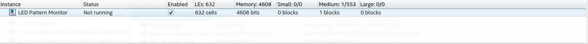

# Lab-05 Signal Tap

## Overview
Created a signal tap to monitor the internal LED Patterns and state machine for Lab-04. 

## Deliverables

### Questions 
> How much FPGA on-chip memory was required to monitor your signals?

4608 bits 

