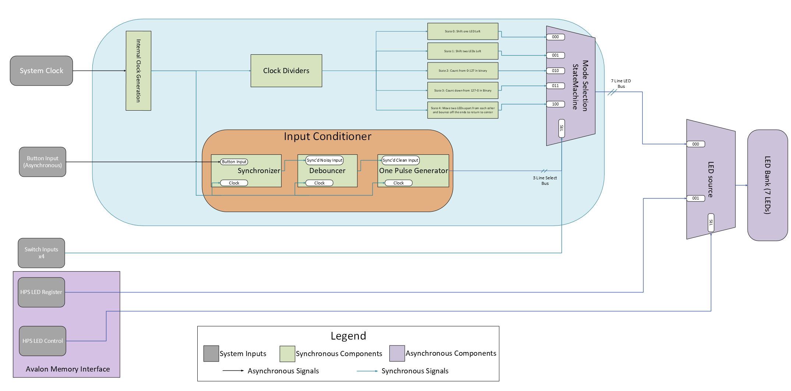

# Lab-06 EELE-467 Creating a Custom Hardware Component in Platform Designer

## Overview
In this lab, a custom interface on the Avalon bus was created. This will allow for the HPS to connected to the FPGA. By creating this interface we can control the LEDs from the Arm CPU through the Linux Kernal. This will be important when it comes to interfacing the two devices together. 

## Deliverables

### Updated Block Diagram:

To interface with the HPS a series of registers were created to read and write data to the Avalon bus. The register maps are as follows:

### LED Control Register:

This register controls which device is actively controling the LEDs. Being either the HPS or the FPGA.

### LED Pattern Register:

This register holds the pattern to be displayed when the HPS controls the LEDs. 

### LED Base Period Register:

This register holds the base period to run the LED patterns at. This is a fixed point precision number. 4 bits after the redux point. 

### Questions 
>How did you connect these register to the ARM CPUs in teh HPS?
The registers are connected via the Avalon Memory Interface. This allows for the HPS to connect to the LEDs via the Linux Kernal and the AValong Memory Interface. 

>What is the base address of your component in your Platform Designer system?
0x0
